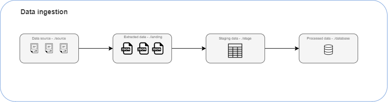

# Usage of taxi services

## Project's building options

1. Docker

    (WIP)

2. Jupyter notebooks
    
    Dowload the HTML jupyter notebook.
    

## Task description

    Given a zip file that contains two weeks of card transactions data for taxi services, extract and process the data for exploratory analysis:
        1. When are taxi services used most often? what can explain usage patterns?
        2. What is the typical amount of money spent on taxi service?
    
## Technical tips

    Amounts
    - Money amounts are expressed using two integers: value and in addition
    precision which defines how many last digits of value represent currency subunit.
    For instance, for currency CHF, value of 5506000 with precision of 5 means the
    amount was 55 francs and 6 centimes (i.e. 55.06 CHF).

    Time
    - Time (transaction_info.timestamp) is expressed as unix timestamp in milliseconds. Note, all events took place in Europe/Vienna time zone.

## Data ingestion archteture

Considerations made for the data pipeline's construction:

* The data source provides zip files with JSON data. This ZIP files will be delivered to a data source folder (./source)
* When the ZIP file lands the source folder, a script will run to extract and deliver the raw file to the landing folder (./landing)
* After landing the raw data, the pipeline will start the data processing and prepare the data to be ingested in a table. For this project, it will be used Dataframes for data storage.
* With the prepared data, it will run a process to ingest it to the final table for exploratory analysis

## Data analysis

(WIP)